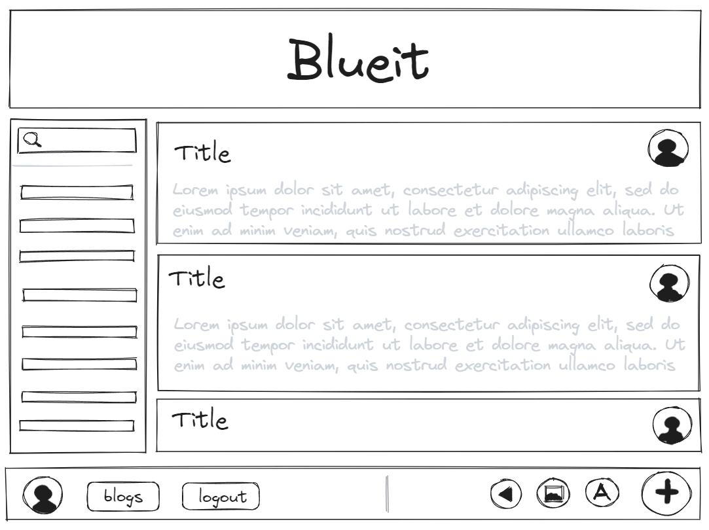

# Blueit

## Description

Whatever you want it to be, however you want it to be.

## Table of Contents

## Installation

## Usage

## Credits

https://biteable.github.io/biteable-ui

## Tests

## Questions

## Contributing

## License

This project is licensed under the Mozilla Public License. To learn more about the Mozilla license, visit: https://www.mozilla.org/en-US/MPL
